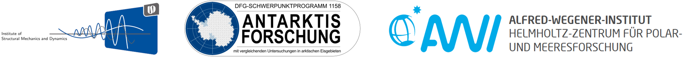
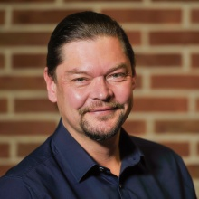
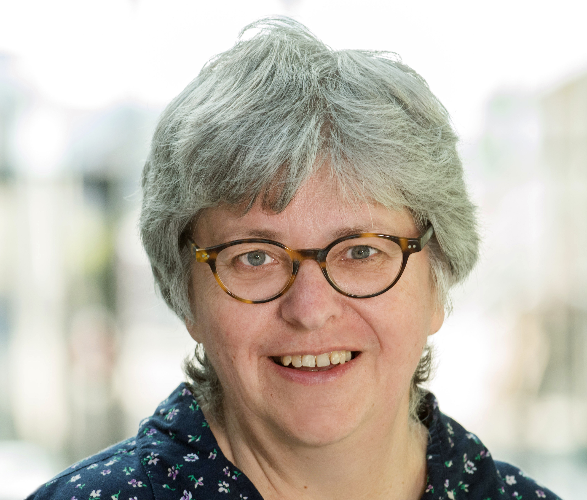
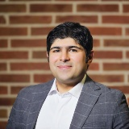
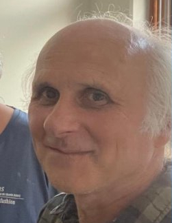
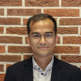
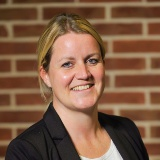

# Overview

<!-- PROJECT LOGO -->

  

This repository supports the scientific endeavors in the project "Modeling of small scale processes in Antarctic sea ice and their impact on the biological pump in the future Southern Ocean - a physical-biological coupled bi-scale approach" within the framework of DFG Priority Program SPP1158 Antarctic research (<https://www.spp-antarktisforschung.uni-rostock.de/>).

# Team

<ul>
<li style="list-style-type: disc; margin-bottom: 20px;">
</li>

  

    
  

  

    
Prof. Ricken is the Director at the Institute of Structural Mechanics and Dynamics in Aerospace Engineering (ISD) at the university of Stuttgart and a Co-PI in the project. He is an expert in the Theory of porous media and its application in a vareity of applications, including environmental engineering.

  

<li style="list-style-type: disc; margin-bottom: 20px;">
</li>

  

    
  

  

    
Dr. Silke Thoms is a Senior Scientist in the ecological chemistry department at the Alfred Wegener Institute for Polar and Marine research and a Co-PI in the project. She is an expert on the small scale physical and ecological modeling in marine pelagic and sea ice environments.

  

<li style="list-style-type: disc; margin-bottom: 20px;">
</li>

  

    
  

  

    
Dr. Seyed Morteza Seyedpour is the Head of Laboratories at the Institute of Structural Mechanics and Dynamics in Aerospace Engineering (ISD) in the University of Stuttgart and a Co-PI in the project. He is involved in the design of experiments, and mathematical modeling.

  

<li style="list-style-type: disc; margin-bottom: 20px;">
</li>

  

    
  

  

    
Dr. Bernd Kutschan is a postdoctoral researcher in the ecological chemistry department at the Alfred Wegener Institute for Polar and Marine research. He is responsible for modeling microscale phase separation and incorporation of anti-freeze mechanisms. 

  

<li style="list-style-type: disc; margin-bottom: 20px;">
</li>

  

    
  

  

    
Raghav Pathak is a doctoral researcher at the Institute of Structural Mechanics and Dynamics in Aerospace Engineering (ISD) in the University of Stuttgart. He is responsible for mathematical model development, simulations, and dissemination ofresearch results to the general audience. 

  

<li style="list-style-type: disc; margin-bottom: 20px;">
</li>

  

    
  

  

    
Dr. Andrea Thom was a former colleague and postdoctoral researcher at the Institute of Structural Mechanics and Dynamics in Aerospace Engineering (ISD) in the University of Stuttgart. She was responsible for initial project coordination, and model development. 

  

</ul>